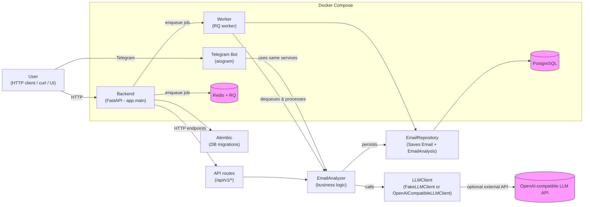

# Architecture Overview

Below is a high-level architecture diagram for the AI Mail Assistant service.



Notes

- The primary runtime is the FastAPI backend which exposes HTTP endpoints for synchronous analysis and endpoints that enqueue background jobs for asynchronous processing.
- EmailAnalyzer is the core business service: it delegates text analysis to an LLM client and returns a structured EmailAnalysisResult.
- For local development and CI the default LLM client is a deterministic FakeLLMClient; in production an OpenAI-compatible client can be enabled.
- Persistence: EmailRepository writes Email + EmailAnalysis in a single transaction to PostgreSQL.
- Async processing: Redis + RQ queue and a separate worker process run the same analyzer and repository code to process queued jobs.
- Telegram bot is an additional front-end that reuses EmailAnalyzer and repository code.

How to run (local, Docker Compose)

```bash
# build and run all services (default: fake LLM)
docker compose up --build

# run with real OpenAI-compatible provider
LLM_PROVIDER=openai \
OPENAI_API_KEY=your_api_key \
OPENAI_BASE_URL=https://api.openai.com/v1 \
OPENAI_MODEL=gpt-4o-mini \
docker compose up --build
```
